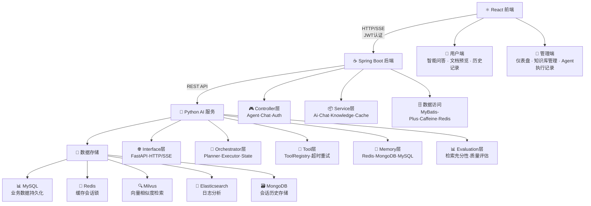
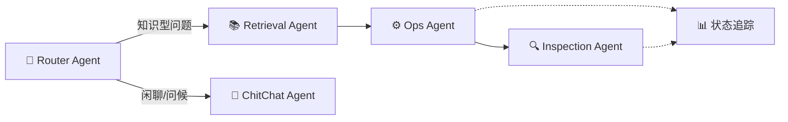
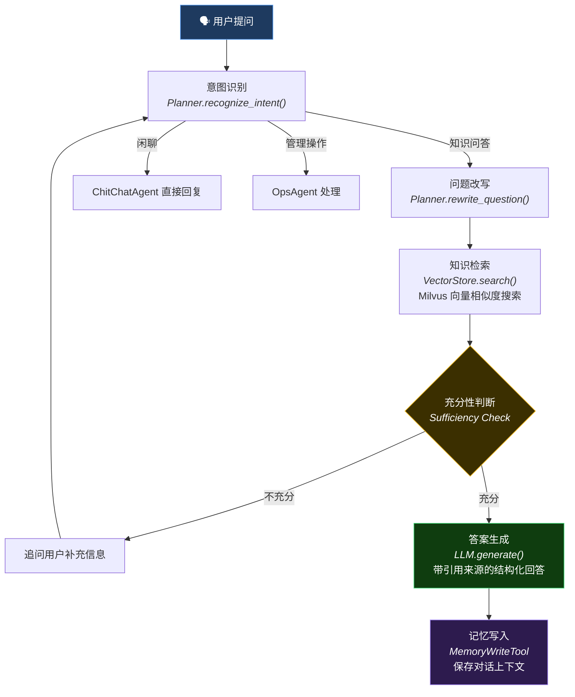
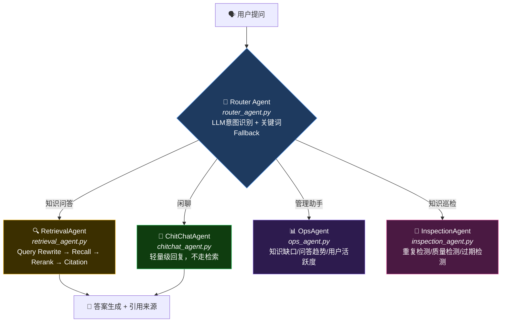
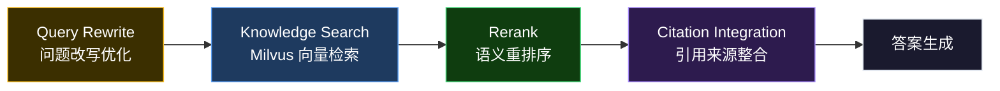
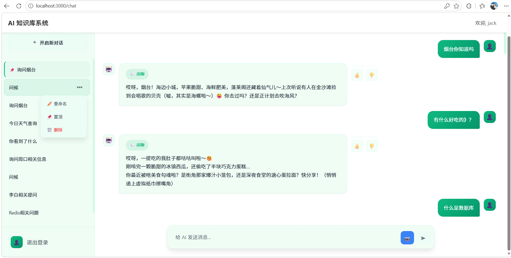
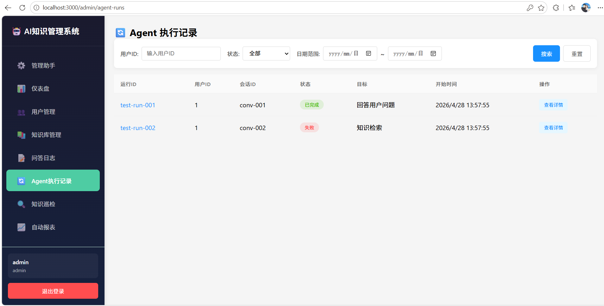
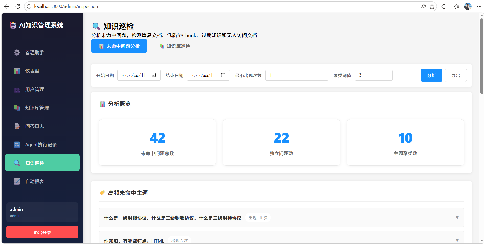

<div align="center">

# 🚀 AgentCraft — 多 Agent 协作智能知识库系统

**基于 Spring Boot + FastAPI + React 构建的 RAG 知识库问答平台，内置五层可编排 Agent 架构与多 Agent 协作机制，适合作为 Agent 后端开发学习项目与简历展示项目。**

[](https://openjdk.org/)
[](https://spring.io/projects/spring-boot)
[](https://python.org/)
[](https://fastapi.tiangolo.com/)
[](https://reactjs.org/)
[](https://milvus.io/)
[](https://redis.io/)
[](https://mysql.com/)
[](https://github.com/your-username/ai-knowledge-system/actions/workflows/ci.yml)
[](LICENSE)

</div>

***

## 📖 项目简介

AgentCraft 是一个"**前端 + Java 后端 + Python AI 微服务**"的**全栈 RAG 知识库系统**。用户可上传 PDF、Word、TXT 等文档构建私有知识库，系统自动完成解析、向量化存储，提问时通过语义检索 + Rerank 重排序精准召回相关文档，生成带引用来源的结构化答案。

核心亮点是 **五层可编排 Agent 架构**——Interface、Orchestrator、Tool、Memory、Evaluation 五层解耦，支持意图识别→问题改写→检索→充分性判断→答案生成的完整工作流。系统内置 Router / Retrieval / Ops / Inspection 多 Agent 协作，通过统一 Tool Registry 管理 AI 能力，支持 runId/traceId 全链路追踪、四级记忆体系与 Caffeine + Redis 多级缓存。各模块的设计思路与实现细节详见 [AgentCraft 学习指南](AgentCraft学习指南.md)。

### 适用场景

- **企业知识库**：将内部文档、技术手册、FAQ 等知识资产结构化，员工通过自然语言快速检索，降低知识查找成本。
- **智能客服**：基于产品文档和历史工单自动回答用户问题，Router Agent 自动识别意图分流至知识问答或闲聊，减轻人工客服压力。
- **知识运维**：Ops Agent 自动分析知识缺口、问答趋势与用户活跃度，Inspection Agent 检测重复/过期/低质文档，保障知识库质量。
- **Agent 架构学习与简历展示**：项目涵盖 RAG 全链路、多 Agent 协作、Tool Registry、多级缓存、SSE 流式输出等核心知识点，适合作为 Agent 后端开发学习项目。

**一句话总结**：不只是一个 RAG 问答系统，更是一个 Agent 架构学习项目。

***

## 🏗️ 系统架构



### 多Agent协作流程



***

## ✨ 核心亮点

### 亮点一：五层可编排 Agent 架构

将 AI 服务拆分为 Interface → Orchestrator → Tool → Memory → Evaluation 五层，每层职责单一、可独立扩展。

**单 Agent 端到端执行流程：**



**关键代码：**

- `intent/classifier.py` — 统一意图分类器，LLM优先 + 关键词Fallback
- `agent/orchestrator.py` — 编排器，创建 state、调用 planner、逐步执行
- `agent/planner.py` — 规划器，调用统一分类器进行意图识别
- `agent/executor.py` — 执行器，根据 step\_type 分发到具体实现
- `agent/state.py` — 状态管理，run\_id / trace\_id / step 追踪

***

### 亮点二：多 Agent 协作机制

Router Agent 负责任务分发，Retrieval Agent 专精检索，Ops Agent 负责运营分析，各 Agent 独立可扩展。

**多 Agent 协作流程：**



**Retrieval Agent 内部链路：**



**关键代码：**

- `intent/classifier.py` — 统一意图分类器，LLM优先 + 关键词Fallback
- `workflows/router_agent.py` — 4 种任务路由（闲聊/知识问答/管理助手/巡检）
- `workflows/retrieval_agent.py` — 完整检索链路，可配置开关
- `workflows/ops_agent.py` — 运营分析，直接查 MySQL，不走 LLM

***

### 亮点三：统一 Tool Registry 工具体系

将知识检索、OCR、文档摘要、对话记忆等 AI 能力抽象为标准 Tool，定义输入/输出 Schema、超时、重试与权限元数据。

```python
# tools/base.py — 工具基类
class Tool(ABC):
    name: str
    input_schema: ToolSchema      # 输入参数 Schema
    output_schema: ToolSchema     # 输出结果 Schema
    metadata: ToolMetadata        # 超时/重试/权限

    @abstractmethod
    def execute(self, parameters: Dict) -> Dict:
        pass

# tools/registry.py — 工具注册器（单例）
class ToolRegistry:
    def register_tool(tool: Tool)      # 注册工具
    def invoke_tool(name, params)       # 调用（带超时+重试）
    def get_all_tools() -> Dict         # 列出所有工具
```

**已注册工具列表：**

| 工具名                         | 功能       | 超时  | 重试 |
| --------------------------- | -------- | --- | -- |
| knowledge\_search           | 知识库语义检索  | 30s | 3  |
| question\_rewrite           | 问题改写优化   | 30s | 3  |
| rerank                      | 语义重排序    | 30s | 3  |
| citation                    | 引用来源整合   | 5s  | 1  |
| conversation\_memory\_read  | 对话记忆读取   | 5s  | 1  |
| conversation\_memory\_write | 对话记忆写入   | 5s  | 1  |
| ocr\_extract                | OCR 文字提取 | 30s | 3  |
| doc\_summary                | 文档摘要生成   | 30s | 3  |

***

### 亮点四：全链路可观测

每个 Agent 运行都有 runId + traceId，支持执行记录查询、步骤追踪、工具调用审计。

```
run_id: "test-run-001"
  ├─ step 1: intent_recognition     → ✅ confidence: 0.95
  ├─ step 2: question_rewrite       → ✅ "什么是数据库" → "请解释数据库的定义、分类和常见应用场景"
  ├─ step 3: knowledge_search       → ✅ 返回 3 个相关 chunk
  ├─ step 4: result_evaluation      → ✅ 充分性: sufficient
  └─ step 5: answer_generation      → ✅ 生成答案 + 2 个引用来源
```

***

## 🛠️ 技术栈

### 后端

| 技术              | 版本    | 用途            |
| --------------- | ----- | ------------- |
| Java            | 17    | 开发语言          |
| Spring Boot     | 3.2.3 | 后端主框架         |
| MyBatis-Plus    | 3.5.x | ORM 持久层       |
| MySQL           | 8.0   | 关系型数据库        |
| Redis           | 7.0   | 分布式缓存、会话管理    |
| Caffeine        | 3.x   | 本地缓存，毫秒级响应    |
| Spring Security | 6.2.x | JWT 认证 + 权限控制 |
| Spring WebFlux  | -     | SSE 流式响应      |
| 七牛云 Kodo        | -     | 文档对象存储        |

### AI 服务

| 技术        | 版本        | 用途               |
| --------- | --------- | ---------------- |
| Python    | 3.9+      | AI 服务语言          |
| FastAPI   | 0.110+    | 高性能 Web 框架       |
| LangChain | 0.1.x     | RAG 流程管理         |
| Milvus    | 2.4+      | 向量数据库，语义检索       |
| 通义千问      | qwen-plus | 大语言模型            |
| DashScope | -         | Embeddings 向量化服务 |

### 前端

| 技术      | 版本   | 用途       |
| ------- | ---- | -------- |
| React   | 18.2 | 前端主框架    |
| Vite    | 5.x  | 构建工具     |
| ECharts | 6.x  | 数据可视化    |
| Axios   | 1.x  | HTTP 客户端 |

***

## 📸 效果展示

### 用户端

|          智能问答（带参考来源）          |  闲聊路由（Router Agent 自动识别） |
| :---------------------------: | :----------------------: |
|  |  |

### 管理端

|            仪表盘            |               Agent 执行记录              |
| :-----------------------: | :-----------------------------------: |
|  |  |

|       知识巡检（Ops Agent）       |             自动报表            |
| :-------------------------: | :-------------------------: |
|  |  |

***

## 🚀 快速启动

### 方式一：Docker Compose 一键部署（推荐）

```bash
# 克隆项目
git clone https://github.com/your-username/ai-knowledge-system.git
cd ai-knowledge-system

# 一键启动（首次需要构建镜像，约 5-10 分钟）
docker-compose up -d

# 访问
# 前端：http://localhost:80
# Java 后端：http://localhost:8080
# Python AI 服务：http://localhost:8000
# 用户端：http://localhost:3000/login
# 管理端：http://localhost:3000/admin/login
```

> 需要安装 [Docker Desktop](https://www.docker.com/products/docker-desktop/)。首次启动会自动下载 MySQL、Redis 并构建服务镜像。

### 方式二：手动启动

#### 环境要求

- JDK 17+
- Python 3.9+
- Node.js 18+
- MySQL 8.0+
- Redis 7.0+

> **开发模式零配置可跑**：向量存储默认使用 FAISS（零依赖，无需 Milvus），文档上传默认本地存储（无需七牛云），短信验证码未配置时为模拟模式（验证码输出到控制台）。

#### 1. 数据库准备

```bash
mysql -u root -p -e "CREATE DATABASE ai_knowledge_db CHARACTER SET utf8mb4 COLLATE utf8mb4_unicode_ci;"
mysql -u root -p ai_knowledge_db < sql/schema.sql
```

### 2. Java 后端启动

```bash
# 编辑 src/main/resources/application.yml 配置 MySQL / Redis 连接
mvn clean package
java -jar target/ai-knowledge-system-*.jar
# 默认端口 8080
```

### 3. Python AI 服务启动

```bash
cd python-service
pip install -r requirements.txt
# 配置 .env（MILVUS_HOST、DASHSCOPE_API_KEY 等）
python main.py
# 默认端口 8000
```

### 4. 前端启动

```bash
cd frontend
npm install
npm run dev
# 默认端口 3000
```

### 默认账号

- 用户端：http://localhost:3000/login （手机验证码注册登录，未配置短信时为模拟模式）
- 管理端：http://localhost:3000/admin/login（`admin` / `admin123`）

> 项目跑通后，建议按 [学习指南](AgentCraft学习指南.md#5-分阶段学习路线) 的分阶段路线开始学习。

***

## 📝 简历写法参考

> 以下话术可直接用于简历项目经历描述，面试时围绕每条展开讲解即可。

**1. 负责五层可编排 Agent 架构设计与实现**，将 AI 服务拆分为 Interface、Orchestrator、Tool、Memory、Evaluation 五层，实现意图识别→问题改写→检索→充分性判断→答案生成的完整工作流；通过 StepType 枚举 + Planner 动态规划步骤，支持任务编排与独立扩展，runId/traceId 实现全链路追踪。

**2. 设计并实现多 Agent 协作机制**，Router Agent 基于统一意图分类器（LLM优先 + 关键词Fallback）识别任务类型并分发至对应 Agent，Retrieval Agent 专精 Query Rewrite + 多路召回 + Rerank + Citation 全链路检索，Ops Agent 负责知识缺口分析与运营报告生成；各 Agent 独立可扩展，共享状态协同工作。

**3. 构建统一 Tool Registry 工具体系**，将知识检索、OCR、文档摘要、对话记忆等 AI 能力抽象为标准 Tool，定义输入/输出 Schema、超时、重试与权限元数据；通过单例 ToolRegistry 实现工具注册/查找/调用，支持单工具执行与多工具链编排，基于 ThreadPoolExecutor 实现超时控制。

**4. 设计并实现多级缓存架构**，Caffeine 本地缓存 + Redis 分布式缓存两级架构，实现缓存穿透/雪崩防护机制，热点数据毫秒级响应；通过 @Async 异步处理提升系统吞吐量。

**5. 实现 RAG 全链路知识库系统**，支持多格式文档（PDF/Word/TXT）自动解析、向量化存储至 Milvus，用户提问时通过语义检索 + Rerank 重排序精准召回相关文档，生成带引用来源的结构化答案，支持在线预览/下载。

***

## 🎓 学完这个项目你能掌握什么

| 能力         | 对应代码                                 | 面试考点                            |
| ---------- | ------------------------------------ | ------------------------------- |
| RAG 全链路设计  | python-service/core/ + tools/        | 向量检索、Embedding、Rerank           |
| Agent 架构设计 | python-service/agent/                | 编排器、规划器、执行器、状态机                 |
| 多 Agent 协作 | python-service/workflows/            | Router 分发、Agent 间通信             |
| 意图识别       | python-service/intent/classifier.py  | LLM意图识别 + 关键词Fallback           |
| 工具注册体系     | python-service/tools/registry.py     | 插件化设计、Schema 校验、超时重试            |
| 多级缓存       | src/.../service/impl/CacheService    | Caffeine + Redis、穿透/雪崩防护        |
| SSE 流式输出   | src/.../controller/ChatController    | WebFlux Flux、Server-Sent Events |
| JWT 认证     | src/.../config/SecurityConfig        | Token 生成/校验/刷新                  |
| 向量数据库      | python-service/core/vector\_store.py | Milvus 部署、索引、检索、删除              |

***

## ⚠️ 已知问题与改进方向

### 当前存在的问题

1. **Rerank 默认关闭**：Retrieval Agent 中 `use_rerank` 默认为 False，需要手动开启。支持 `simple`（规则排序，零依赖）和 `bge`（语义重排，需下载 \~1.1GB 模型）两种模式，开发环境建议用 `simple`。
2. **前端无 TypeScript**：前端使用纯 JavaScript，没有类型检查，对于大型项目可维护性不足。
3. **短信验证码为模拟模式**：未配置阿里云短信时，验证码直接输出到控制台，适合开发调试，不适合生产环境。

### 改进方向

- 接入更多 LLM 提供商（OpenAI / Claude / 本地 Ollama）
- 前端迁移到 TypeScript + 状态管理库
- 完善单元测试覆盖率
- 意图识别结果缓存（避免重复调用LLM）

***

## 📄 开源协议

[MIT License](LICENSE) — 可自由用于学习、毕设、简历项目。

详细学习说明文档请查看 [AgentCraft 学习指南](AgentCraft学习指南.md)。

**新手入门**：如果你是刚学完基础、没有项目经验的新手，建议先阅读 [新手友好食用指南](新手友好食用指南.md)，从环境搭建到核心概念理解，手把手带你上手。

🤝 欢迎大家在学习过程中遇到问题时，随时提交 [issue](https://github.com/EvanYao826/AgentCraft/issues)，一起交流和改进！
